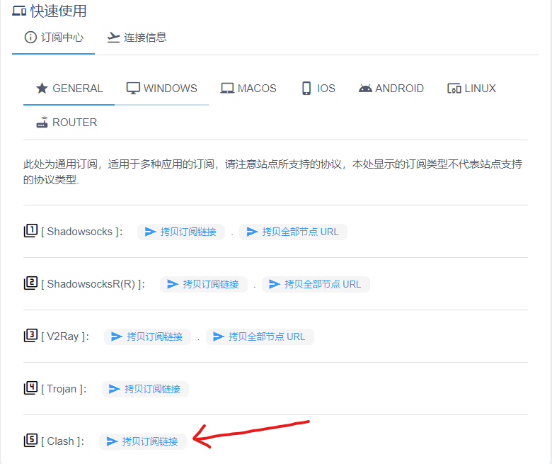
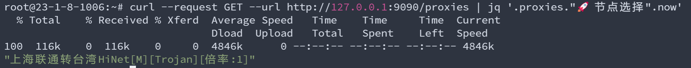

# 一、解压文件

将clash可执行程序压缩包```clash-linux-amd64-v1.18.0.gz```上传至服务器，并用下列命令解压：

```shell
gzip -d clash-linux-amd64-v1.18.0.gz
chmod +x chmod +x clash-linux-amd64-v1.18.0
```

# 二、预执行程序

执行clash： 
```shell
./clash-linux-amd64-v1.18.0
```  
执行后运行结果如下： 
  
此时，~/.config/clash路径下生成config.yaml文件和Conntry-mmbd文件  

Ctrl+C退出Clash，登录网站，获取配置文件url:  
  

利用以下命令下载配置文件：
```shell
wget https://www.ccsub.online/link/你自己的Clash订阅地址 -O config.yaml
```

将下载的config.yaml覆盖~/.config/clash目录下的config.yaml文件  
```shell
mv -i ~/config.yaml ~/.config/clash/config.yaml 
```

注意：config.yaml中包含controller address，可手动修改其监听端口号。

重新启动clash，将出现如下界面：
  

# 三、选择节点

利用如下命令查看当前可选择的节点：  
```shell
curl --request GET --url http://127.0.0.1:9090/proxies
```
  

利用如下命令查看当前所选择的节点：  
```shell
curl --request GET --url http://127.0.0.1:9090/proxies | jq '.proxies."🚀 节点选择".now'
```
一开始，系统为选择节点，处于如下所示的直连状态：
  

🚀 节点选择这个策略组包含emoji和中文，所以需要进行转义，打开网站```https://tool.oschina.net/encode?type=4```
  

拼接为以下curl命令，其中proxies后面是你要操作的策略组转义字符串，data内的name对应需要操作的完整节点名
```shell
curl --request PUT --url "http://127.0.0.1:9090/proxies/%F0%9F%9A%80%20%E8%8A%82%E7%82%B9%E9%80%89%E6%8B%A9" --header "Content-Type: text/plain" --data "{\"name\": \"上海联通转台湾HiNet[M][Trojan][倍率:1]\"}"
```

命令完成时不会有任何额外结果：
  

利用命令重新查询当前所选择的节点：
  

利用如下命令查看当前连接：  
```shell
curl --request GET --url http://127.0.0.1:9090/logs
```